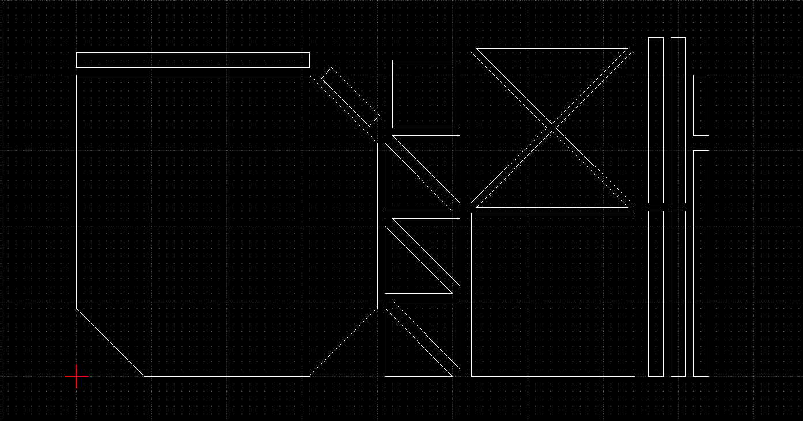
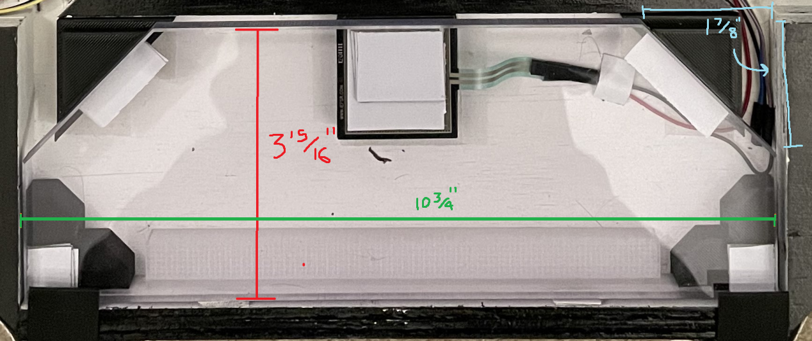
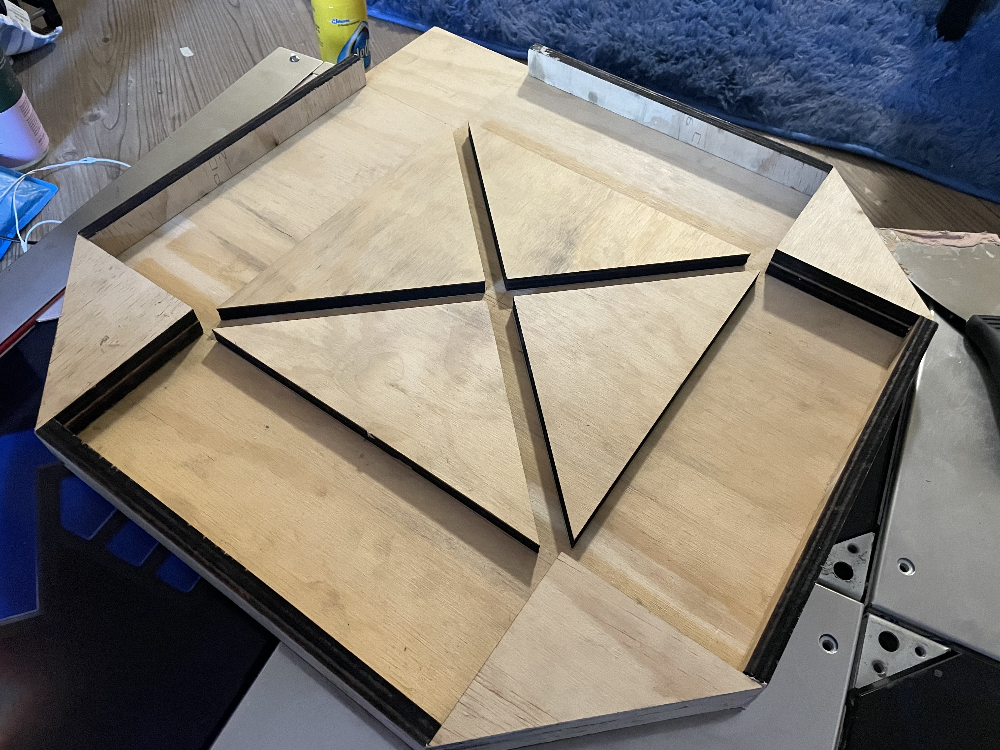
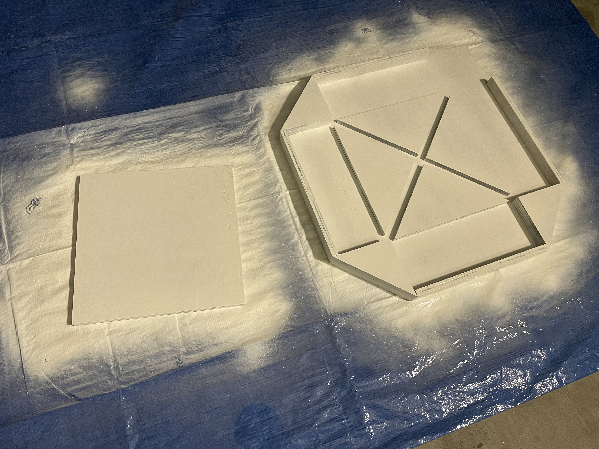
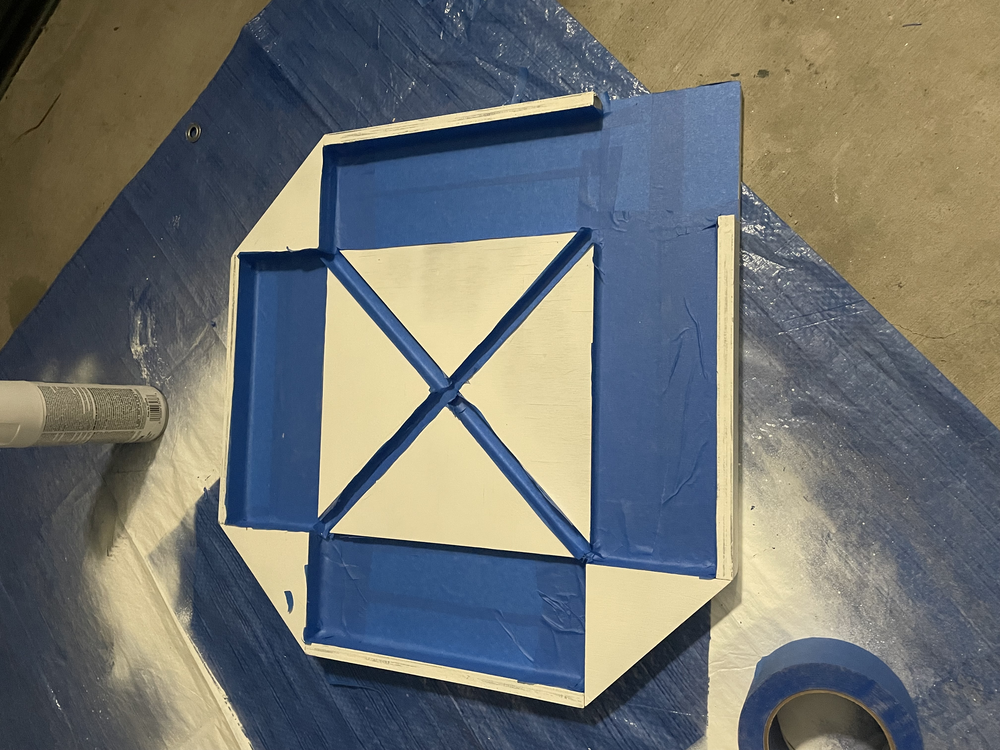
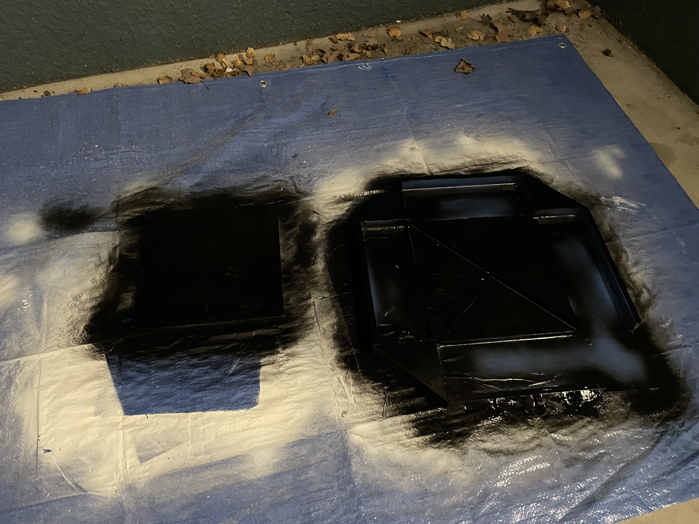
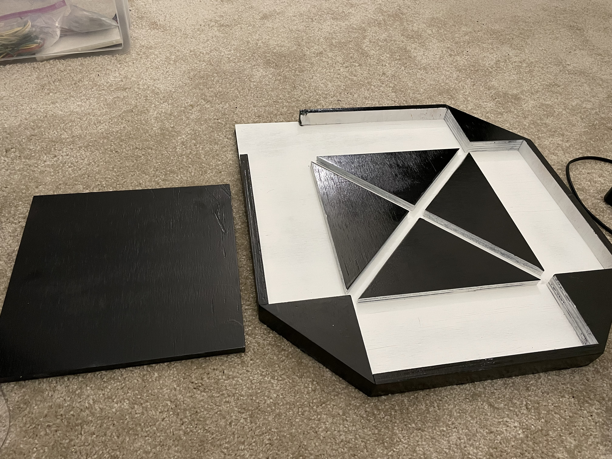

# Teejusb's Travel Pad
 Guide to Build a Travel Pad with FSRs.
 
  <b>Check out pad in action [HERE](http://www.youtube.com/watch?v=_NM0flVgFBk)</b>
## Table of Contents
- [Teejusb's Travel Pad](#teejusbs-travel-pad)
  - [Table of Contents](#table-of-contents)
  - [Credits](#credits)
  - [Bill of Materials](#bill-of-materials)
  - [Parts to 3D Print](#parts-to-3d-print)
  - [Steps](#steps)
    - [Cutting the Pieces](#1-cutting-the-pieces)
    - [Before the Build](#2-before-the-build)
    - [Building the Pad](#3-building-the-pad)
  - [Adding LEDs](#adding-leds)
## Credits
 - To **dj505** as I used their [build log](https://imgur.com/a/IuHijaS) as the main basis when creating this travel pad.
 - To **4199** as the original design was theirs.

## Bill of Materials
|   Part           |Price          |
|------------------|---------------|
|[2'x4' 1/2" Plywood](https://www.homedepot.com/p/1-2-in-x-2-ft-x-4-ft-Radiata-Pine-Plywood-Actual-0-469in-x-23-75-in-x-47-75-in-414715/313354418)|$25|
|[3/8" Polycarbonate](https://www.tapplastics.com/product/plastics/cut_to_size_plastic/polycarbonate_sheets/516)|$24 - $561|
|[Teensy 4.0](https://www.pjrc.com/store/teensy40_pins.html) (or equivalent)|$25|
|[4 x FSR 406](https://buyinterlinkelectronics.com/collections/new-standard-force-sensors/products/fsr-model-406?variant=31639756210313)|$30|
|[Wires](https://www.amazon.com/gp/product/B07TX6BX47)|$15|
|[30 Row Breadboard](https://www.amazon.com/dp/B07PCJP9DY)|$6|
|[Wood Glue](https://www.amazon.com/dp/B001N7X1UA)|$3|
|[Clamps](https://www.amazon.com/dp/B0875WV3CD)|$30|
|[Wood Filler](https://www.amazon.com/dp/B00K25F1UW)|$11|
|[Putty Knife](https://www.amazon.com/dp/B06XC8ZGK2)|$6|
|[Sandpaper](https://www.amazon.com/dp/B07VT261KT)|$13|
|[Primer](https://www.amazon.com/dp/B00L20TRW4)|$12|
|[Spray Paint](https://www.amazon.com/dp/B000PIK1YC)|$9|
|[Masking Tape](https://www.amazon.com/dp/B001EJMS4M)|$11|
|[Dual Lock Fastener](https://www.amazon.com/dp/B004V3RALO)|$20|
|Various 3D Prints|$20-???2|
|Center Metal Panel|$15-???3|
|Wood Laser Cutting Service4|$160|
|||
|**Total**|**$275-$307** (Not incl. Laser Cutting)|

> 1 For the Polycarbonate, I personally got the edges chamfered and the corners cut for about $56. This makes the panel identical to an ITG/DDR panel in shape. You can alternatively simply get 10 3⁄4" x 3 15⁄16" rectangles for about $6 per panel.

> 2 I personally had access to a 3D printer so I only spent about $20 in materials. I don't know how much it costs to print these parts using a local service.

> 3 The pad is designed to use a DDR/ITG/PIU square metal panel which fits perfectly on top of the 10 7⁄8" x 10 7⁄8" square wood piece. You have the following options on how to procure one and some replacements:
> 1. Buy/Use one from an existing pad or straight from Andamiro. I personally used one from my existing machine.
> 2. Bend metal yourself. I believe they are 1⁄8" thick 304 Stainless Steel. If you make the main center part 11" x 11" and the edges less than 1⁄2" tall (3⁄8" or 1⁄4" should work) then that should fit the square wood piece.
> 3. Replace the square wood piece with another material (e.g. Polycarbonate). If you go this route you'd want it to be the full 11" x 11" (instead of the 10 7⁄8" x 10 7⁄8") as you won't be adding a metal piece on top of it.

> 4 While I don't think laser cutting the wood was needed and one could cut it on their own, I opted to pay for the service for the precision.

## Parts to 3D Print

|   Part           |Description    |
|------------------|---------------|
|[**The Box**](https://www.tinkercad.com/things/bpEsTf4kXBO)|Houses all the electronics|
|**FSR Blocks (Comes in [1⁄2"](https://www.tinkercad.com/things/cAF0ry7Ph2o) and [5⁄8"](https://www.tinkercad.com/things/kU1zQFTylWj) variants)**|Used to attach the FSRs. If you like your panels higher by default and want to use less tape for the height, you can get the 5⁄8" variant|
|**Front Brackets (Comes in [1⁄2"](https://www.tinkercad.com/things/evKB2N12mK5) and [5⁄8"](https://www.tinkercad.com/things/hcPSjkuzODB) variants)**|Same idea as above. Use the same height that you chose for the FSR blocks above. This part is not necessary if you have rectangular panels.|
|[**Back Brackets**](https://www.tinkercad.com/things/07s7Wb1h3cf)|Used to support the backside of the panels. If you have rectangular panels, then print this part twice so you can also use this to support the frontside.|
|[**LED Diffusers**](https://www.tinkercad.com/things/8S0zVbZenex)|This is used to both add further support for the backside of the panels, while also allowing one to diffuse LED strips if one would like to add it to the travel pad. This piece is optional.|
|[**Panel Brackets**](https://www.tinkercad.com/things/keSFPU1u1Jc)|Used to hold the panel in and prevent it from popping out. The design is fairly fragile, and duct tape does perform just as well|

## Steps
 ### 1. Cutting the Pieces
 If you decide to Laser Cut your plywood, you can use <a href="files/travelpad.dxf">this DXF</a> file to get a quote from a local laser cutting service. To view this file, You can check out <a href="https://librecad.org/">LibreCAD</a> which is a free software for CAD. Check out the image below to see what it looks like. For me it cost about $160 to get it laser cut. If you have access to a hand saw/table saw, cutting your plywood could be considerably cheaper (potentially at the cost of time/precision).
 

For the polycarbonate you have two options.
   1. You could simply get 10 3⁄4" x 3 15⁄16" rectangles to save some of the cost.
   2. To make it more accurate to DDR/ITG refer to the image below for the dimensions. There is also approximately a 1mm chamfer which will make the edges not be so sharp.

    
### 2. Before the Build

After your wood is cut and before putting things together, we will first smooth out your pieces. It's possible that your plywood has some holes or uneven surfaces. You can use the wood filler and sand paper to try and smoothen out your surfaces. This is mostly important for the larger pieces (the base and the wooden square). Simply add some wood filler to the affected areas, smoothen it out with the putty knife, and let it sit until it's dry. Once it is, then sand the surface using 100 and then 150 grit sandpaper.

### 3. Building the Pad

 Here is the base. Not much to say about this.

 Add on the corner triangles. First, wood glue two of the triangles together (hold tight with the clamps). Once it has dried and set, then attach it to the base using the wood glue. Repeat for each the remaining too corners 

 Attach the walls. It is hugely important that you use clamps here to securely attach the walls to the base. If you don't you might run into issues with your <a href="https://clips.twitch.tv/AmazonianLaconicPineappleRlyTho-e3TrOF4Ut9JD_z1f">pad breaking</a> and you'll have to reglue it down the line.

 Attach the 4 center triangles. This will be used to path the wires for the travel pad. It might be hard to get the clamps in place for this so I ended up just using some heavy weight. Make sure you measure before attaching it. It should be placed in a 11"x11" square centered with respect to the pad base.

 A (slightly) better view.

 Just checking the positioning of the square wood piece. The 4 triangles that it sits on top of will poke out from under the center squre. This is intentional as the metal panel will sit on top of square wood piece, which will then give it the full 11"x11" size. <b>Do NOT attach the square piece to the base.</b>

 Smoothen out the edges. It's possible some things might have been slightly misaligned when gluing things together. You can correct some of this by using the woodfiller and sanding it down to a smooth finish.

 Once you think your base is sanded and ready, you can then prime the two large pieces. Let it dry, flip it over, and then prime the bottom as well.

 Once the primer has dried, you can mask off the insides and prep it for the main paint job.

 Paint the two large pieces, let it dry, flip it over, and paint the bottom as well/

 Once the paint has dried, remove the masking tape and check out your paint job.

 Attach the 3D printed bits for the insides. I superglued them, but I did notice that sometimes it would come off and I needed to reglue it. Not really a problem, just something to note.

 Check to make sure the center panel fits.

 Add the wiring. Check out my <a href="https://www.github.com/teejusb/fsr">FSR guide</a> on how setup the wiring and flashing the software. Notice the two strips of Dual Lock Fasteners. This is used to to attach the square wood piece to the base while still allowing it to be removable. I use the same fastener to attach the brackets that hold the panel in. As a fair warning, it's pretty hard to pry off the square wood piece with this method which could be seen as both good and bad. If you want to make it easier make it easier, one could use smaller lengths of the fastener so there's less force holding it together.

 Pop in the panels! One thing to note is that while the brackets do hold the panel in, they seem a bit fragile and seem to come off often. I did notice that duct tape did do a better job but that seems a bit jank so I do intend to come up with a better solution soon.

### 4. Adding LEDs

Coming soon! The pad is designed to also have LEDs but at the moment I haven't completed that bit and the code doesn't have FastLED support out of the box.
